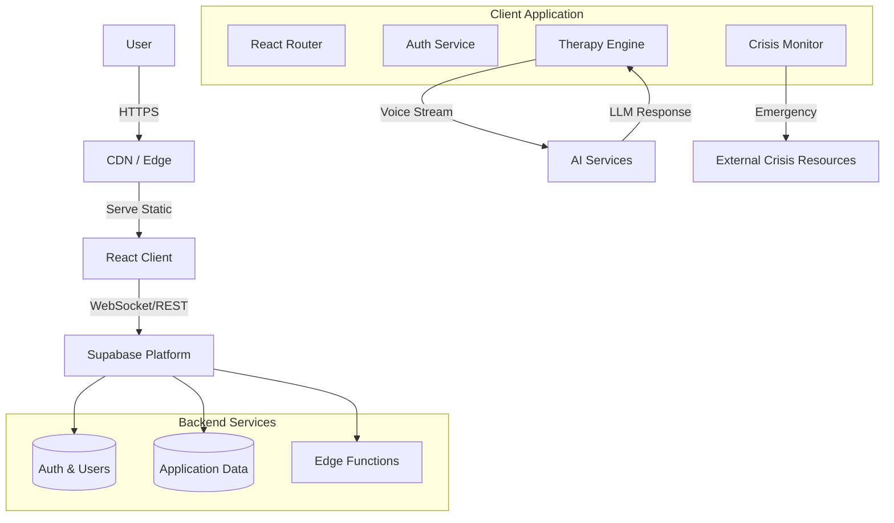

# System Architecture

## Overview

The Everything AI - Insight Therapy Learn is a client-centric Single Page Application (SPA) built with React and TypeScript, leveraging Supabase for backend-as-a-service features. The architecture emphasizes security, privacy, and modularity.

## Diagram

## Core Components

### 1. Presentation Layer (Frontend)
- **Framework**: Vite + React
- **Design System**: Shadcn/UI + Tailwind CSS. Components are built to be accessible (ARIA compliant) and responsive.
- **State Management**: 
  - **Local State**: `useState`, `useReducer` for component-level logic.
  - **Server State**: `React Query` (via Supabase client) for data fetching and caching.
  - **Global State**: Minimal usage, mostly handled via Context for Theme and Auth.

### 2. Logic Layer (Hooks & Services)
Business logic is extracted from components into Custom Hooks and Services to ensure testability and separation of concerns.
- **Hooks**: `useAuth`, `useVoiceTherapy`, `useContactForm` bind UI to Services.
- **Services**: `AuditService`, `TherapyService`, `ErrorTrackingService` handle pure business logic and API interactions.

### 3. Data & Backend Layer (Supabase)
- **Authentication**: JWT-based auth managed by Supabase Auth.
- **Database**: PostgreSQL with Row Level Security (RLS) policies to ensure users can only access their own data.
- **Edge Functions**: Serverless functions for sensitive operations (e.g., payment processing, emotion analysis integration).

### 4. Security & Privacy Layer
- **Client**: Content Security Policy (CSP), Sanitization (Zod), Encryption at rest (LocalStorage).
- **Transport**: TLS 1.3 for all connections.
- **Compliance**: GDPR-compliant data deletion flows and audit logging.

## Design Decisions

### Why Supabase?
We chose Supabase for its strong security model (RLS), real-time capabilities (crucial for therapy chat), and seamless integration with modern React ecosystems. It allows us to ship faster without managing infrastructure.

### Why Vite?
Vite provides a lightning-fast development experience and optimized production builds with seamless code-splitting, which is essential for our performance goals (Core Web Vitals).

### Why Tailwind + Shadcn?
This combination offers a "build what you need" approach. We get accessible, high-quality primitives without the bloat of a heavy component library, and the flexibility to style freely.
